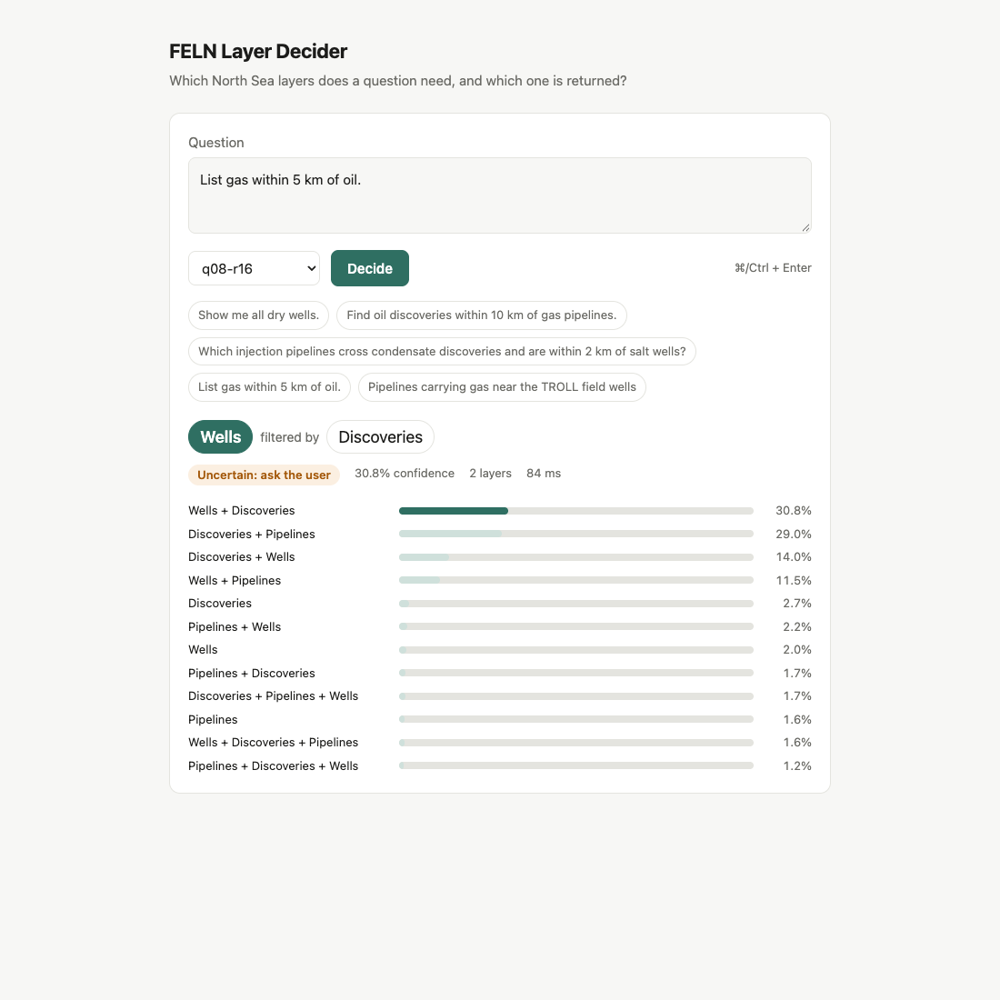
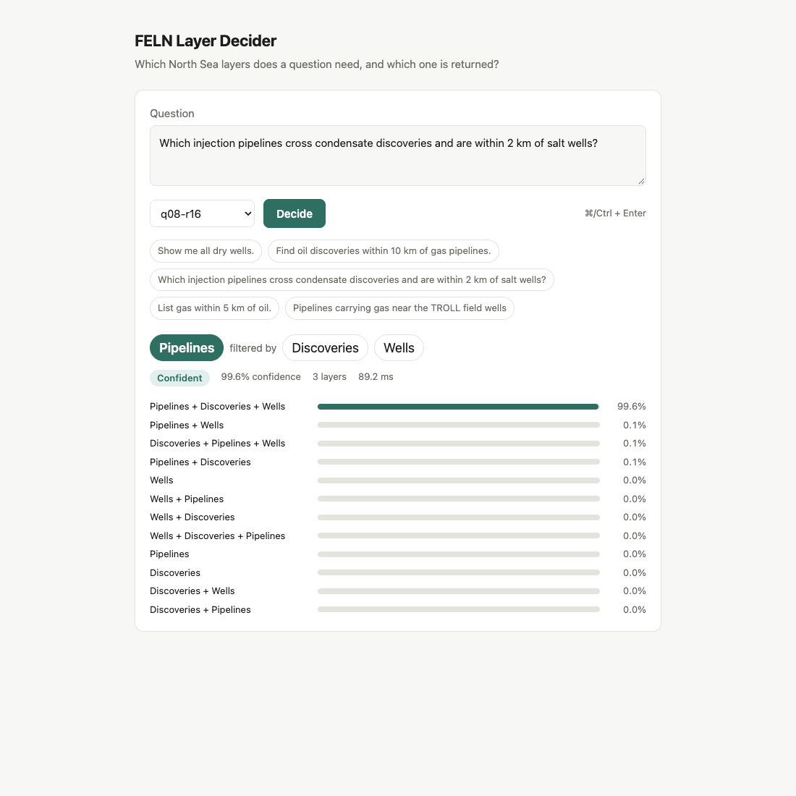

# feln-unsloth

Decision model that reads a North Sea question and decides which FELN layers it
needs: one, two or three of Wells, Pipelines, Discoveries, and which one is primary
(`layers[0]`, the layer returned). Built with Unsloth's `FastDecisionModel` (an LLM plus
a Clef-style scoring head, no text generation), following
[Train your own Decision Model with Unsloth](https://unsloth.ai/docs/basics/train-your-own-decision-model-with-unsloth).
Every answer comes with a calibrated probability.

**Full write-up: [docs/REPORT.md](docs/REPORT.md)** covers data, label design, split,
environment, recipe, all runs, error analysis, measurement notes and how to reproduce.

## Decision

One `choice` question with 12 options: primary layer plus the unordered set of
secondaries (`Wells`, `Wells+Pipelines`, `Wells+Discoveries+Pipelines`, ...).

## Results (test: 300 questions held out from `FELN.json`)

| Model | Exact | ECE | Confidence ≥ 0.7: kept / right | Train | Merged |
|---|---|---|---|---|---|
| Keyword baseline | 47.3% | | | | |
| Gemma 4 E4B | 95.3% | 0.030 | 93% / 98.2% | 10.7 min | 15 GB |
| Qwen3.5-0.8B, r64 | 95.3% | 0.025 | 88% / 98.9% | 4.5 min | 1.7 GB |
| Qwen3.5-2B | 95.0% | 0.032 | 90% / 98.5% | 5.2 min | 4.4 GB |
| Qwen3.5-4B | 94.3% | 0.021 | 89% / 98.5% | 8.2 min | 8.8 GB |
| **Qwen3.5-0.8B, r16 (recommended)** | 94.3% | **0.018** | 89% / 98.5% | 4.9 min | 1.7 GB |
| Llama 3.2 3B | 94.3% | 0.034 | 89% / 98.5% | 5.6 min | 6.3 GB |
| Gemma 4 E2B | 91.7% | 0.037 | 91% / 97.1% | 7.6 min | 9.7 GB |
| Laya (ModernBERT, 16-bit) | 90.3-92.0% | 0.020-0.041 | 85% / 96.5% | 2 min | 808 MB |

The layer count is right 100% of the time for the best runs, and every remaining error
is a two-layer question. Model size barely matters: about 95% is the ceiling set by
ambiguous subtype words ("within 3 km of condensate": pipeline or discovery?) and by
label noise from the humanize step. One test question is 0.33 points, so rows within
about 1 point of each other are tied.

## Files

| File | Purpose |
|---|---|
| `prepare.py` | `FELN.json` → `data/{train,val,test}.jsonl` (stratified 80/10/10), prints baselines |
| `train.py` | fine-tune, calibrate on val, score test, save adapter + merged (runs on gc1) |
| `predict.py` | ask a trained model (adapter or merged folder) about new questions |
| `app.py`, `index.html` | web tester: FastAPI backend + vanilla JS page |
| `runs/<run>/` | `metrics.json`, `test_predictions.jsonl` for every run (weights stay on gc1) |
| `logs/` | training logs copied from gc1 |
| `docs/REPORT.md` | detailed report |

## Quick start

```bash
python3 prepare.py ~/Documents/ArcGIS/Projects/NorthSea/FELN.json data
rsync -a prepare.py train.py predict.py data gc1:feln-unsloth/
ssh gc1; tmux attach -t feln-unsloth; cd ~/feln-unsloth
CUDA_VISIBLE_DEVICES=0 .venv/bin/python train.py --model unsloth/Qwen3.5-0.8B --out runs/q08-r16
.venv/bin/python predict.py runs/q08-r16/adapter "Find oil discoveries within 10 km of gas pipelines."
#   -> Discoveries+Pipelines  Discoveries+Pipelines=0.94  Discoveries+Wells=0.05
```

## Web tester





`app.py` (FastAPI) + `index.html` (vanilla JS, one file). Pick any trained run, type a
question, see the primary layer, the filter layers, the confidence (flagged below the
0.7 gate) and all 12 probabilities.

```bash
# gc1, in tmux (stopped 2026-10-09; start it again with:)
uv pip install -p .venv/bin/python fastapi uvicorn   # once
CUDA_VISIBLE_DEVICES=0 .venv/bin/python -m uvicorn app:app --host 127.0.0.1 --port 8095
# Mac
ssh -fN -L 8095:127.0.0.1:8095 gc1 && open http://localhost:8095
```

API: `GET /api/models`, `POST /api/decide {"text": "...", "model": "q08-r16"}` →
`{"answer", "probabilities": [[option, p], ...], "ms"}`. Models load on first use
(about 14 s), then answer in about 85 ms. The server binds to localhost on purpose:
reach it through the SSH tunnel, not an open port.
